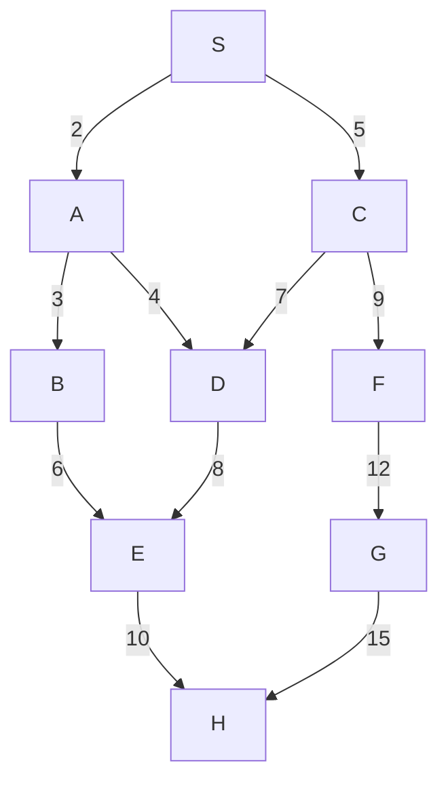
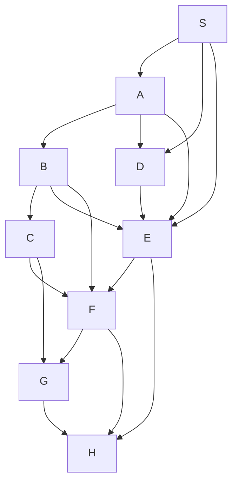
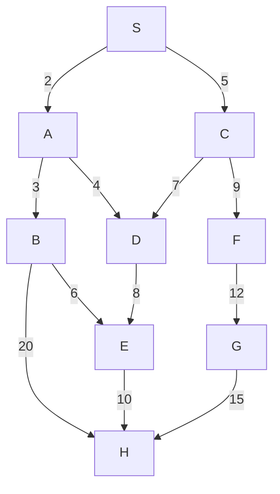
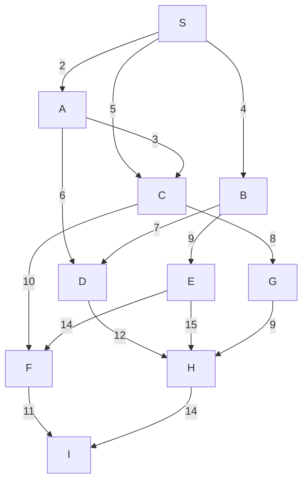

# LAB 1: THUẬT TOÁN TÌM KIẾM MÙ  
## Mục tiêu  
1. Hiểu rõ khái niệm và cơ chế hoạt động của các thuật toán tìm kiếm mù trong trí tuệ nhân tạo.
2. Thành thạo triển khai BFS và DFS trên các đồ thị vô hướng, bao gồm đồ thị không trọng số và có trọng số.
3. Phân tích hạn chế của BFS và DFS khi áp dụng trên đồ thị có trọng số.
4. Thực hiện minh họa thủ công và lập trình với chú thích rõ ràng để kiểm chứng kết quả tìm kiếm.

## Thuật toán sử dụng  
Trong bài lab này sử dụng 2 thuật toán: tìm kiếm theo chiều rộng BFS và tìm kiếm theo chiều sau DFS.  
Ngoài ra, còn làm quen với các loại đồ thị: không trọng số (các cạnh có trọng số ngầm định bằng 1, BFS tối ưu theo số cạnh) và có trọng số (các cạnh có trọng số khác nhau, BFS và DFS không được thiết kế để tối ưu hóa tổng trọng số, dẫn đến kết quả không tối ưu).  

## Bài tập minh họa  
### Bài tập về nhà  
#### Bài 1: Viết mã Python để chạy BFS và DFS trên **Đồ thị mẫu 6** và **Đồ thị mẫu 7**. Định nghĩa đồ thị dưới dạng từ điển và thêm chú thích chi tiết.  
Đồ thị mẫu 6:  

- **Các cạnh và trọng số**:
  - S-A: 2, S-C: 5, A-B: 3, A-D: 4, B-E: 6, C-D: 7, C-F: 9, D-E: 8, E-H: 10, F-G: 12, G-H: 15.
- **Đặc điểm**: Nhiều đường đi từ S đến H, có chu trình (A-D-E-B-A).

##### Đồ thị BFS trên đồ thị mẫu 6:  

Hàm BFS chính:  
  
graph: đồ thị với các cạnh có trọng số  
start: nút bắt đầu tìm kiếm  
goal: nút đích đến  

Khởi tạo hàng đợi và tập visited:  
  
Hàng đợi gồm có: node, path, total_weight.  

Vòng lặp chính:  
  
Nếu tìm được đích thì trả về đường đi và tổng trọng số  
    

Duyệt các nút kề của node hiện tại, nếu neighbour chưa được thăm thì thêm vào visited và xếp vào hàng đợi với đường đi mới và tổng trọng số mới.  
  
1. Khởi tạo: Hàng đợi = [(S, [S], 0)], Đã thăm = {S}
2. Lấy S, thêm A, C: Hàng đợi = [(A, [S, A], 2), (C, [S, C], 5)], Đã thăm = {S, A, C}
3. Lấy A, thêm B, D: Hàng đợi = [(B, [S, A, B], 5), (C, [S, C], 5), (D, [S, A, D], 6)], Đã thăm = {S, A, C, B, D}
4. Lấy C, thêm F: Hàng đợi = [(B, [S, A, B], 5), (F, [S, C, F], 14), (D, [S, A, D], 6)], Đã thăm = {S, A, C, B, D, F}
5. Lấy B, thêm E: Hàng đợi = [(E, [S, A, B, E], 11), (F, [S, C, F], 14), (D, [S, A, D], 6)], Đã thăm = {S, A, C, B, D, F, E}
6. Lấy D, không có kề mới: Hàng đợi = [(F, [S, C, F], 14), (E, [S, A, B, E], 11)]
7. Lấy F, thêm G: Hàng đợi = [(E, [S, A, B, E], 11), (G, [S, C, F, G], 26)], Đã thăm = {S, A, C, B, D, F, E, G}
8. Lấy E, thêm H: Hàng đợi = [(G, [S, C, F, G], 26), (H, [S, A, B, E, H], 21)], Đã thăm = {S, A, C, B, D, F, E, G, H}
9. Lấy H: H là đích, trả về [S, A, B, E, H], trọng số 21  

Nếu không tìm thấy đường đi, trả về "return None, 0".  

Gọi đồ thị mẫu 6 có trọng số, mỗi đỉnh liên kết với các cặp (nút kề, trọng số)  
  

Tìm đường đi BFS từ S đến H và in ra kết quả:  
  

##### Đồ thị DFS trên đồ thị mẫu 6  

Hàm DFS chính:  
  
graph: đồ thị với các cạnh có trọng số  
start: nút bắt đầu tìm kiếm  
goal: nút đích đến  
visited: các nút đã thăm  
path: các nút đi qua  
total_weight: tổng trọng số  

Khởi tạo tập đã thăm và đường đi nếu chưa có:  
  

Thêm đỉnh hiện tại vào tập đã thăm "visited.add(start)".  

Nếu hiện tại là đích cần đến thì trả về đường đi và tổng trọng số:  
  

Duyệt các nút kề:  
  
Duyệt các nút kề chưa được thăm, gọi đệ quy để tiếp tục DFS. Nếu tìm thấy đường đi thì trả về luôn.  
1. Khởi tạo: Ngăn xếp = [(S, [S], 0)], Đã thăm = {S}
2. Lấy S, thêm A: Ngăn xếp = [(A, [S, A], 2)], Đã thăm = {S, A}
3. Lấy A, thêm B: Ngăn xếp = [(B, [S, A, B], 5)], Đã thăm = {S, A, B}
4. Lấy B, thêm E: Ngăn xếp = [(E, [S, A, B, E], 11)], Đã thăm = {S, A, B, E}
5. Lấy E, thêm H: Ngăn xếp = [(H, [S, A, B, E, H], 21)], Đã thăm = {S, A, B, E, H}
6. Lấy H: H là đích, trả về [S, A, B, E, H], trọng số 21

Nếu không tìm thấy đường đi, trả về "return None, 0".  

Gọi đồ thị mẫu 6 có trọng số, mỗi đỉnh liên kết với các cặp (nút kề, trọng số)  
  

Tìm đường đi DFS từ S đến H và in ra kết quả:  
  

##### Kết quả khi chạy BFS và DFS:  
  

Đồ thị mẫu 7:  

- **Các cạnh**: S-A, S-D, S-E, A-B, A-D, A-E, B-C, B-E, B-F, C-F, C-G, D-E, E-F, E-H, F-G, F-H, G-H.
- **Đặc điểm**: Mật độ cạnh cao, nhiều chu trình, nhiều đường đi từ S đến H.

##### Đồ thị BFS trên đồ thị mẫu 7  

Hàm BFS chính:  
  
graph: đồ thị với các cạnh có trọng số  
start: nút bắt đầu tìm kiếm  
goal: nút đích đến  

Khởi tạo hàng đợi và tập visited:  
  
Hàng đợi gồm có: node, path, total_weight.  

Vòng lặp chính:  
  
Nếu tìm được đích thì trả về đường đi  

 
Duyệt các nút kề của node hiện tại, nếu neighbour chưa được thăm thì thêm vào visited và xếp vào hàng đợi với đường đi mới.  

1. Khởi tạo: Hàng đợi = [(S, [S])], Đã thăm = {S}
2. Lấy S, thêm A, D, E: Hàng đợi = [(A, [S, A]), (D, [S, D]), (E, [S, E])], Đã thăm = {S, A, D, E}
3. Lấy A, thêm B: Hàng đợi = [(D, [S, D]), (E, [S, E]), (B, [S, A, B])], Đã thăm = {S, A, D, E, B}
4. Lấy D, không có kề mới (A, E đã thăm): Hàng đợi = [(E, [S, E]), (B, [S, A, B])]
5. Lấy E, thêm F, H: Hàng đợi = [(B, [S, A, B]), (F, [S, E, F]), (H, [S, E, H])], Đã thăm = {S, A, D, E, B, F, H}
6. Lấy B, thêm C: Hàng đợi = [(F, [S, E, F]), (H, [S, E, H]), (C, [S, A, B, C])], Đã thăm = {S, A, D, E, B, F, H, C}
7. Lấy F, không có kề mới (G, H đã thăm hoặc chưa tới): Hàng đợi = [(H, [S, E, H]), (C, [S, A, B, C])]
8. Lấy H: H là đích, trả về [S, E, H] 

Nếu không tìm thấy đường đi, trả về "return None, 0".  

Gọi đồ thị mẫu 7  

Tìm đường đi BFS từ S đến H và in ra kết quả:  
  

##### Đồ thị DFS trên đồ thị mẫu 7  

Hàm DFS chính:  
  
graph: đồ thị với các cạnh có trọng số  
start: nút bắt đầu tìm kiếm  
goal: nút đích đến  
visited: các nút đã thăm  
path: các nút đi qua  
total_weight: tổng trọng số  

Khởi tạo tập đã thăm và đường đi nếu chưa có:  
  

Thêm đỉnh hiện tại vào tập đã thăm "visited.add(start)".  

Nếu hiện tại là đích cần đến thì trả về đường đi:  

Duyệt các nút kề:  
  
Duyệt các nút kề chưa được thăm, gọi đệ quy để tiếp tục DFS. Nếu tìm thấy đường đi thì trả về luôn.  
1. Khởi tạo: Ngăn xếp = [(S, [S])], Đã thăm = {S}
2. Lấy S, thêm A: Ngăn xếp = [(A, [S, A])], Đã thăm = {S, A}
3. Lấy A, thêm B: Ngăn xếp = [(B, [S, A, B])], Đã thăm = {S, A, B}
4. Lấy B, thêm C: Ngăn xếp = [(C, [S, A, B, C])], Đã thăm = {S, A, B, C}
5. Lấy C, thêm F: Ngăn xếp = [(F, [S, A, B, C, F])], Đã thăm = {S, A, B, C, F}
6. Lấy F, thêm G: Ngăn xếp = [(G, [S, A, B, C, F, G])], Đã thăm = {S, A, B, C, F, G}
7. Lấy G, thêm H: Ngăn xếp = [(H, [S, A, B, C, F, G, H])], Đã thăm = {S, A, B, C, F, G, H}
8. Lấy H: H là đích, trả về [S, A, B, C, F, G, H]

Nếu không tìm thấy đường đi, trả về "return None, 0".  

Gọi đồ thị mẫu 7   
  
 
Tìm đường đi DFS từ S đến H và in ra kết quả:  

##### Kết quả khi chạy BFS và DFS:  
  

#### Bài 2  
Hàm BFS chính:  
  
graph: đồ thị với các cạnh có trọng số  
start: nút bắt đầu tìm kiếm  
goal: nút đích đến  

Khởi tạo hàng đợi và danh sách các đường đi từ start đến goal:  
  

Vòng lặp chính:  
  
Nếu tìm được đích thì thêm vào danh sách  
  
Không return vì phải tìm tất cả đường đi, nên sẽ tiếp tục duyệt các phần tử còn lại
   
Duyệt các nút kề của node hiện tại, nếu neighbour không có đường đi hiện tại thì thêm nút kề và đường đi mới vào hàng đợi.  
  

Sau khi tìm thấy đường đi thì trả về "return all_paths".  

Gọi đồ thị mẫu 7 không trọng số  
  

Tìm tất cả đường đi BFS từ S đến H và in ra kết quả:  
  

##### Kết quả:  
  

#### Bài 3  

- **Các cạnh và trọng số**:
  - S-A: 2, S-C: 5, A-B: 3, A-D: 4, B-E: 6, B-H: 20, C-D: 7, C-F: 9, D-E: 8, E-H: 10, F-G: 12, G-H: 15.
 
##### Đồ thị BFS  

Hàm BFS chính:  
  
graph: đồ thị với các cạnh có trọng số  
start: nút bắt đầu tìm kiếm  
goal: nút đích đến  

Khởi tạo hàng đợi và tập visited:  
  
Hàng đợi gồm có: node, path, total_weight.  

Vòng lặp chính:  
  
Nếu tìm được đích thì trả về đường đi và tổng trọng số  
    

Duyệt các nút kề của node hiện tại, nếu neighbour chưa được thăm thì thêm vào visited và xếp vào hàng đợi với đường đi mới và tổng trọng số mới.  
  
1. Khởi tạo: Hàng đợi = [(S, [S], 0)], Đã thăm = {S}
2. Lấy S, thêm A, C: Hàng đợi = [(A, [S, A], 2), (C, [S, C], 5)], Đã thăm = {S, A, C}
3. Lấy A, thêm B, D: Hàng đợi = [(B, [S, A, B], 5), (C, [S, C], 5), (D, [S, A, D], 6)], Đã thăm = {S, A, C, B, D}
4. Lấy C, thêm F: Hàng đợi = [(B, [S, A, B], 5), (F, [S, C, F], 14), (D, [S, A, D], 6)], Đã thăm = {S, A, C, B, D, F}
5. Lấy B, thêm E, H: Hàng đợi = [(E, [S, A, B, E], 11), (H, [S, A, B, H], 25), (F, [S, C, F], 14), (D, [S, A, D], 6)], Đã thăm = {S, A, C, B, D, F, E, H}
6. Lấy D, không có kề mới: Hàng đợi = [(F, [S, C, F], 14), (E, [S, A, B, E], 11)]
7. Lấy F, thêm G: Hàng đợi = [(E, [S, A, B, E], 11), (H, [S, A, B, H], 25), (G, [S, C, F, G], 26)], Đã thăm = {S, A, C, B, D, F, E, H, G}
8. Lấy E, thêm H: H là đích, trả về [S, A, B, H], 25  

Nếu không tìm thấy đường đi, trả về "return None, 0".  

Gọi đồ thị mẫu 6 có trọng số, mỗi đỉnh liên kết với các cặp (nút kề, trọng số)  
  
  
Tìm đường đi BFS từ S đến H và in ra kết quả:  
  

##### Đồ thị DFS  
Hàm DFS chính:  
  
graph: đồ thị với các cạnh có trọng số  
start: nút bắt đầu tìm kiếm  
goal: nút đích đến  
visited: các nút đã thăm  
path: các nút đi qua  
total_weight: tổng trọng số  

Khởi tạo tập đã thăm và đường đi nếu chưa có:  
  

Thêm đỉnh hiện tại vào tập đã thăm "visited.add(start)".  

Nếu hiện tại là đích cần đến thì trả về đường đi và tổng trọng số:  
  

Duyệt các nút kề:  
  
Duyệt các nút kề chưa được thăm, gọi đệ quy để tiếp tục DFS. Nếu tìm thấy đường đi thì trả về luôn.  
1. Khởi tạo: Ngăn xếp = [(S, [S], 0)], Đã thăm = {S}
2. Lấy S, thêm A: Ngăn xếp = [(A, [S, A], 2)], Đã thăm = {S, A}
3. Lấy A, thêm B: Ngăn xếp = [(B, [S, A, B], 5)], Đã thăm = {S, A, B}
4. Lấy B, thêm E: Ngăn xếp = [(E, [S, A, B, E], 11)], Đã thăm = {S, A, B, E}
5. Lấy E, thêm H: Ngăn xếp = [(H, [S, A, B, E, H], 21)], Đã thăm = {S, A, B, E, H}
6. Lấy H: H là đích, trả về [S, A, B, E, H], trọng số 21

Nếu không tìm thấy đường đi, trả về "return None, 0".  

Gọi đồ thị mẫu 6 có trọng số, mỗi đỉnh liên kết với các cặp (nút kề, trọng số)  
  
  
Tìm đường đi DFS từ S đến H và in ra kết quả:  
  

##### Kết quả khi chạy BFS và DFS:  
  

#### Phân tích sự thay đổi  
- Đường đi BFS thay đổi từ [S, A, B, E, H] thành [S, A, B, H], tổng trọng số thay đổi từ 21 sang 25. Vì BFS không quan tâm đến trọng số, nó chỉ quan tâm đến số cạnh nên dù thêm B --> |20| H có thêm trọng số, nhưng [S, A, B, H] vẫn là đường đi ngắn nhất (dù trọng số lớn hơn).
- Đường đi DFS không thay đổi, vẫn là [S, A, B, E, H] trọng số 21. Vì DFS tìm kiếm sâu theo nhánh nên các nút kề sẽ được duyệt thoe thứ tự trong danh sách. Vì E nằm trước H trong danh sách, nên DFS sẽ đi qua E trước rồi sau đó mới tới H.

### Bài tập nâng cao  
#### Câu 1  
##### Đo thời gian chạy của BFS trên đồ thị mẫu 6  

Gọi hàm time bằng câu lệnh "import time".  
Hàm BFS chính:  
  
graph: đồ thị với các cạnh có trọng số  
start: nút bắt đầu tìm kiếm  
goal: nút đích đến  

Khởi tạo hàng đợi và tập visited:  
  
Hàng đợi gồm có: node, path, total_weight.  

Vòng lặp chính:  
  
Nếu tìm được đích thì trả về đường đi và tổng trọng số  
    

Duyệt các nút kề của node hiện tại, nếu neighbour chưa được thăm thì thêm vào visited và xếp vào hàng đợi với đường đi mới và tổng trọng số mới.  
  
1. Khởi tạo: Hàng đợi = [(S, [S], 0)], Đã thăm = {S}
2. Lấy S, thêm A, C: Hàng đợi = [(A, [S, A], 2), (C, [S, C], 5)], Đã thăm = {S, A, C}
3. Lấy A, thêm B, D: Hàng đợi = [(B, [S, A, B], 5), (C, [S, C], 5), (D, [S, A, D], 6)], Đã thăm = {S, A, C, B, D}
4. Lấy C, thêm F: Hàng đợi = [(B, [S, A, B], 5), (F, [S, C, F], 14), (D, [S, A, D], 6)], Đã thăm = {S, A, C, B, D, F}
5. Lấy B, thêm E: Hàng đợi = [(E, [S, A, B, E], 11), (F, [S, C, F], 14), (D, [S, A, D], 6)], Đã thăm = {S, A, C, B, D, F, E}
6. Lấy D, không có kề mới: Hàng đợi = [(F, [S, C, F], 14), (E, [S, A, B, E], 11)]
7. Lấy F, thêm G: Hàng đợi = [(E, [S, A, B, E], 11), (G, [S, C, F, G], 26)], Đã thăm = {S, A, C, B, D, F, E, G}
8. Lấy E, thêm H: Hàng đợi = [(G, [S, C, F, G], 26), (H, [S, A, B, E, H], 21)], Đã thăm = {S, A, C, B, D, F, E, G, H}
9. Lấy H: H là đích, trả về [S, A, B, E, H], trọng số 21  

Nếu không tìm thấy đường đi, trả về "return None, 0".  

Gọi đồ thị mẫu 6 có trọng số, mỗi đỉnh liên kết với các cặp (nút kề, trọng số)  
  

Tìm đường đi BFS từ S đến H và in ra kết quả:  
  

Đo thời gian chạy của BFS  
start_bfs: thời điểm bắt đầu chạy của thuật toán, ở đây sử dụng hàm time.perf_counter() vì hàm này cho độ chính xác cao khi đo thời gian.  

path_bfs, weight_bfs: trả về các đỉnh được tạo trên đường đi từ S -> H và tổng trọng số của nó.  

end_bfs: thời điểm kết thúc của thuật toám, ở đây cũng sử dụng hàm time.perf_counter().  

time_bfs = end_bfs - start_bfs: thời gian chạy thực tế = thời gian kết thúc = thời gian bắt đầu.  

Sau cùng, in ra thời gian chạy thực tế và làm tròn đến 5 chữ số thập phân {time_bfs:.5f}.  

##### Đo thời gian chạy của DFS trên đồ thị mẫu 6  

Hàm DFS chính:  
  
graph: đồ thị với các cạnh có trọng số  
start: nút bắt đầu tìm kiếm  
goal: nút đích đến  
visited: các nút đã thăm  
path: các nút đi qua  
total_weight: tổng trọng số  

Khởi tạo tập đã thăm và đường đi nếu chưa có:  
  

Thêm đỉnh hiện tại vào tập đã thăm "visited.add(start)".  

Nếu hiện tại là đích cần đến thì trả về đường đi và tổng trọng số:  
  

Duyệt các nút kề:  
  
Duyệt các nút kề chưa được thăm, gọi đệ quy để tiếp tục DFS. Nếu tìm thấy đường đi thì trả về luôn.  
1. Khởi tạo: Ngăn xếp = [(S, [S], 0)], Đã thăm = {S}
2. Lấy S, thêm A: Ngăn xếp = [(A, [S, A], 2)], Đã thăm = {S, A}
3. Lấy A, thêm B: Ngăn xếp = [(B, [S, A, B], 5)], Đã thăm = {S, A, B}
4. Lấy B, thêm E: Ngăn xếp = [(E, [S, A, B, E], 11)], Đã thăm = {S, A, B, E}
5. Lấy E, thêm H: Ngăn xếp = [(H, [S, A, B, E, H], 21)], Đã thăm = {S, A, B, E, H}
6. Lấy H: H là đích, trả về [S, A, B, E, H], trọng số 21

Nếu không tìm thấy đường đi, trả về "return None, 0".  

Gọi đồ thị mẫu 6 có trọng số, mỗi đỉnh liên kết với các cặp (nút kề, trọng số)  
  

Tìm đường đi DFS từ S đến H và in ra kết quả:  
  

Đo thời gian chạy của DFS  
start_dfs: thời điểm bắt đầu chạy của thuật toán, ở đây sử dụng hàm time.perf_counter() vì hàm này cho độ chính xác cao khi đo thời gian.  

path_dfs, weight_dfs: trả về các đỉnh được tạo trên đường đi từ S -> H và tổng trọng số của nó.  

end_dfs: thời điểm kết thúc của thuật toám, ở đây cũng sử dụng hàm time.perf_counter().  

time_dfs = end_dfs - start_dfs: thời gian chạy thực tế = thời gian kết thúc = thời gian bắt đầu.  

Sau cùng, in ra thời gian chạy thực tế và làm tròn đến 5 chữ số thập phân {time_bds:.5f}.  

So sánh thời gian của BFS và DFS:  
  

Kết quả khi chạy:  
  

BFS chạy chậm hơn DFS vì lí do sau:  
- BFS phải duyệt tất cả các đỉnh cùng mức, có nghĩa là nó sẽ thăm nhiều đỉnh hơn trước khi đến đích -> tốn nhiều thời gian.
- DFS đi sâu theo nhánh mà không cần duyệt các đỉnh cùng mức, nên nó sẽ chỉ đi qua một vài đỉnh trước khi đến đích -> tốn ít thời gian.

##### Đo thời gian chạy của BFS trên đồ thị mẫu 7  

Gọi hàm time bằng câu lệnh "import time".  

Hàm BFS chính:  
  
graph: đồ thị với các cạnh có trọng số  
start: nút bắt đầu tìm kiếm  
goal: nút đích đến  

Khởi tạo hàng đợi và tập visited:  
  
Hàng đợi gồm có: node, path, total_weight.  

Vòng lặp chính:  
  
Nếu tìm được đích thì trả về đường đi  

 
Duyệt các nút kề của node hiện tại, nếu neighbour chưa được thăm thì thêm vào visited và xếp vào hàng đợi với đường đi mới.  

1. Khởi tạo: Hàng đợi = [(S, [S])], Đã thăm = {S}
2. Lấy S, thêm A, D, E: Hàng đợi = [(A, [S, A]), (D, [S, D]), (E, [S, E])], Đã thăm = {S, A, D, E}
3. Lấy A, thêm B: Hàng đợi = [(D, [S, D]), (E, [S, E]), (B, [S, A, B])], Đã thăm = {S, A, D, E, B}
4. Lấy D, không có kề mới (A, E đã thăm): Hàng đợi = [(E, [S, E]), (B, [S, A, B])]
5. Lấy E, thêm F, H: Hàng đợi = [(B, [S, A, B]), (F, [S, E, F]), (H, [S, E, H])], Đã thăm = {S, A, D, E, B, F, H}
6. Lấy B, thêm C: Hàng đợi = [(F, [S, E, F]), (H, [S, E, H]), (C, [S, A, B, C])], Đã thăm = {S, A, D, E, B, F, H, C}
7. Lấy F, không có kề mới (G, H đã thăm hoặc chưa tới): Hàng đợi = [(H, [S, E, H]), (C, [S, A, B, C])]
8. Lấy H: H là đích, trả về [S, E, H] 

Nếu không tìm thấy đường đi, trả về "return None, 0".  

Gọi đồ thị mẫu 7  

Tìm đường đi BFS từ S đến H và in ra kết quả:  
  

Đo thời gian chạy của BFS  
start_bfs: thời điểm bắt đầu chạy của thuật toán, ở đây sử dụng hàm time.perf_counter() vì hàm này cho độ chính xác cao khi đo thời gian.  

path_bfs: trả về các đỉnh được tạo trên đường đi từ S -> H.  

end_bfs: thời điểm kết thúc của thuật toám, ở đây cũng sử dụng hàm time.perf_counter().  

time_bfs = end_bfs - start_bfs: thời gian chạy thực tế = thời gian kết thúc = thời gian bắt đầu.  

Sau cùng, in ra thời gian chạy thực tế và làm tròn đến 7 chữ số thập phân {time_bfs:.7f}.  

##### Đo thời gian chạy của DFS trên đồ thị mẫu 7  

Hàm DFS chính:  
  
graph: đồ thị với các cạnh có trọng số  
start: nút bắt đầu tìm kiếm  
goal: nút đích đến  
visited: các nút đã thăm  
path: các nút đi qua  
total_weight: tổng trọng số  

Khởi tạo tập đã thăm và đường đi nếu chưa có:  
  

Thêm đỉnh hiện tại vào tập đã thăm "visited.add(start)".  

Nếu hiện tại là đích cần đến thì trả về đường đi:  

Duyệt các nút kề:  
  
Duyệt các nút kề chưa được thăm, gọi đệ quy để tiếp tục DFS. Nếu tìm thấy đường đi thì trả về luôn.  
1. Khởi tạo: Ngăn xếp = [(S, [S])], Đã thăm = {S}
2. Lấy S, thêm A: Ngăn xếp = [(A, [S, A])], Đã thăm = {S, A}
3. Lấy A, thêm B: Ngăn xếp = [(B, [S, A, B])], Đã thăm = {S, A, B}
4. Lấy B, thêm C: Ngăn xếp = [(C, [S, A, B, C])], Đã thăm = {S, A, B, C}
5. Lấy C, thêm F: Ngăn xếp = [(F, [S, A, B, C, F])], Đã thăm = {S, A, B, C, F}
6. Lấy F, thêm G: Ngăn xếp = [(G, [S, A, B, C, F, G])], Đã thăm = {S, A, B, C, F, G}
7. Lấy G, thêm H: Ngăn xếp = [(H, [S, A, B, C, F, G, H])], Đã thăm = {S, A, B, C, F, G, H}
8. Lấy H: H là đích, trả về [S, A, B, C, F, G, H]

Nếu không tìm thấy đường đi, trả về "return None, 0".  

Gọi đồ thị mẫu 7   
  
 
Tìm đường đi DFS từ S đến H và in ra kết quả:  
  

start_dfs: thời điểm bắt đầu chạy của thuật toán, ở đây sử dụng hàm time.perf_counter() vì hàm này cho độ chính xác cao khi đo thời gian.  

path_dfs: trả về các đỉnh được tạo trên đường đi từ S -> H.  

end_dfs: thời điểm kết thúc của thuật toám, ở đây cũng sử dụng hàm time.perf_counter().  

time_dfs = end_dfs - start_dfs: thời gian chạy thực tế = thời gian kết thúc = thời gian bắt đầu.  

Sau cùng, in ra thời gian chạy thực tế và làm tròn đến 7 chữ số thập phân {time_dfs:.7f}.  

Kết quả khi chạy:  
  
  

Ở đây, có thể xảy ra 2 trường hợp:
- BFS đi chậm hơn DFS vì BFS phải duyệt tất cả các đỉnh cùng mức, có nghĩa là nó sẽ thăm nhiều đỉnh hơn trước khi đến đích -> tốn nhiều thời gian. DFS đi sâu theo nhánh mà không cần duyệt các đỉnh cùng mức, nên nó sẽ chỉ đi qua một vài đỉnh trước khi đến đích -> tốn ít thời gian.
- DFS đi chậm hơn BFS vì DFS đôi khi có thể đi sai nhánh thì phải quay lại đi từ đầu để tiếp tục thử nhánh khác -> tốn nhiều thời gian. BFS duyệt theo mức nên nếu đích nằm gần điểm bắt đầu thì BFS sẽ tìm thấy nhanh hơn -> tốn ít thời gian.

#### Câu 2  

Các cạnh: S-A: 2, S-B: 4, S-C: 5, A-C: 3, A-B: 7, B-D: 9, B-C: 12, C-E: 10, C-G: 8, D-G: 15, E-H: 7, E-I: 5, F-G: 8, F-H: 16, G-F: 11, G-I: 7.  
Đường đi: Từ S -> I.  

##### Đồ thị BFS  

Hàm BFS chính:  
  
graph: đồ thị với các cạnh có trọng số  
start: nút bắt đầu tìm kiếm  
goal: nút đích đến  

Khởi tạo hàng đợi và tập visited:  
  
Hàng đợi gồm có: node, path, total_weight.  

Vòng lặp chính:  
  
Nếu tìm được đích thì trả về đường đi và tổng trọng số  
    

Duyệt các nút kề của node hiện tại, nếu neighbour chưa được thăm thì thêm vào visited và xếp vào hàng đợi với đường đi mới và tổng trọng số mới.  
  
1. Khởi tạo: Hàng đợi = [(S, [S], 0)], Đã thăm = {S}  
2. Lấy S, thêm A, B, C: Hàng đợi = [(A, [S, A], 2), (B, [S, B], 4), (C, [S, C], 5)], Đã thăm = {S, A, B, C}  
3. Lấy A, thêm D: Hàng đợi = [(B, [S, A, B], 4), (C, [S, C], 5), (D, [S, A, D], 8)], Đã thăm = {S, A, B, C, D}  
4. Lấy B, thêm E: Hàng đợi = [(E, [S, B, E], 13), (C, [S, C], 5), (D, [S, A, D], 8)], Đã thăm = {S, A, B, C, D, E}  
5. Lấy C, thêm F, G: Hàng đợi = [(E, [S, B, E], 13), (F, [S, C, F], 15), (G, [S, C, G], 13), (D, [S, A, D], 8)], Đã thăm = {S, A, B, C, D, E, F, G}  
6. Lấy D, thêm H: Hàng đợi = [(E, [S, B, E], 13), (F, [S, C, F], 15), (G, [S, C, G], 13), (H, [S, A, D, H], 20)], Đã thăm = {S, A, B, C, D, E, F, G, H}  
7. Lấy E, không có kề mới: Hàng đợi = [(F, [S, C, F], 15), (G, [S, C, G], 13), (H, [S, A, D, H], 20)]
8. Lấy F, thêm I: I là đích, trả về [S, C, F, I], trọng số: 26.  

Nếu không tìm thấy đường đi, trả về "return None, 0".  

Gọi đồ thị có trọng số, mỗi đỉnh liên kết với các cặp (nút kề, trọng số)  
  

Tìm đường đi BFS từ S đến I và in ra kết quả:  
  

##### Đồ thị DFS   

Hàm DFS chính:  
  
graph: đồ thị với các cạnh có trọng số  
start: nút bắt đầu tìm kiếm  
goal: nút đích đến  
visited: các nút đã thăm  
path: các nút đi qua  
total_weight: tổng trọng số  

Khởi tạo tập đã thăm và đường đi nếu chưa có:  
  

Thêm đỉnh hiện tại vào tập đã thăm "visited.add(start)".  

Nếu hiện tại là đích cần đến thì trả về đường đi và tổng trọng số:  
  

Duyệt các nút kề:  
  
Duyệt các nút kề chưa được thăm, gọi đệ quy để tiếp tục DFS. Nếu tìm thấy đường đi thì trả về luôn.  
1. Khởi tạo: Ngăn xếp = [(S, [S], 0)], Đã thăm = {S}
2. Lấy S, thêm A: Ngăn xếp = [(A, [S, A], 2)], Đã thăm = {S, A}
3. Lấy A, thêm C: Ngăn xếp = [(C, [S, A, C], 5)], Đã thăm = {S, A, C}
4. Lấy C, thêm F: Ngăn xếp = [(F, [S, A, C, F], 15)], Đã thăm = {S, A, C, F}
5. Lấy F, thêm I: I là đích, trả về [S, A, C, F, I], trọng số: 26  

Nếu không tìm thấy đường đi, trả về "return None, 0".  

Gọi đồ thị có trọng số, mỗi đỉnh liên kết với các cặp (nút kề, trọng số)  
  

Tìm đường đi DFS từ S đến H và in ra kết quả:  

##### Kết quả khi chạy BFS và DFS:  

 

 
  

  

