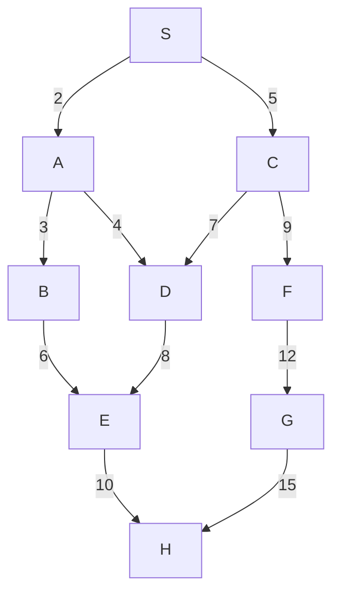

# LAB 1: THUẬT TOÁN TÌM KIẾM MÙ  
## Mục tiêu  
1. Hiểu rõ khái niệm và cơ chế hoạt động của các thuật toán tìm kiếm mù trong trí tuệ nhân tạo.
2. Thành thạo triển khai BFS và DFS trên các đồ thị vô hướng, bao gồm đồ thị không trọng số và có trọng số.
3. Phân tích hạn chế của BFS và DFS khi áp dụng trên đồ thị có trọng số.
4. Thực hiện minh họa thủ công và lập trình với chú thích rõ ràng để kiểm chứng kết quả tìm kiếm.

## Thuật toán sử dụng  
Trong bài lab này sử dụng 2 thuật toán: tìm kiếm theo chiều rộng BFS và tìm kiếm theo chiều sau DFS.  
Ngoài ra, còn làm quen với các loại đồ thị: không trọng số (các cạnh có trọng số ngầm định bằng 1, BFS tối ưu theo số cạnh) và có trọng số (các cạnh có trọng số khác nhau, BFS và DFS không được thiết kế để tối ưu hóa tổng trọng số, dẫn đến kết quả không tối ưu).  

## Bài tập minh họa  
### Bài tập về nhà  
#### Bài 1: Viết mã Python để chạy BFS và DFS trên **Đồ thị mẫu 6** và **Đồ thị mẫu 7**. Định nghĩa đồ thị dưới dạng từ điển và thêm chú thích chi tiết.  
Đồ thị mẫu 6:  

- **Các cạnh và trọng số**:
  - S-A: 2, S-C: 5, A-B: 3, A-D: 4, B-E: 6, C-D: 7, C-F: 9, D-E: 8, E-H: 10, F-G: 12, G-H: 15.
- **Đặc điểm**: Nhiều đường đi từ S đến H, có chu trình (A-D-E-B-A).

Đồ thị BFS trên đồ thị mẫu 6:  

Hàm BFS chính:  
  
graph: đồ thị với các cạnh có trọng số
start: nút bắt đầu tìm kiếm
goal: nút đích đến  
Khởi tạo hàng đợi và tập visited:  
  

